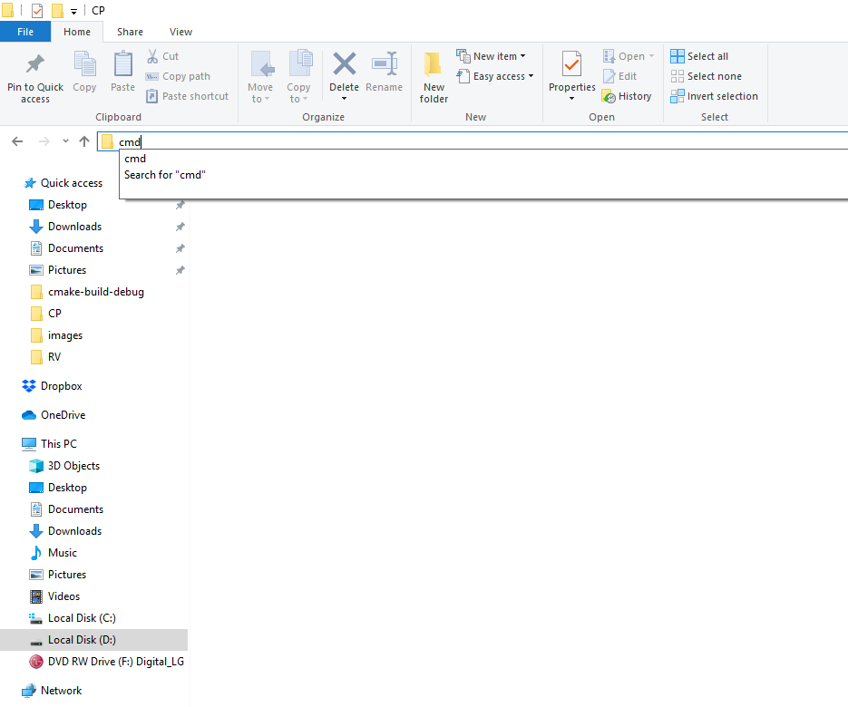

You can follow the steps [here](https://help.github.com/en/articles/cloning-a-repository)
or
* take the url of your repository
* open a console in the folder you want to clone (can simply replace the folder url in the file explorer by "cmd" __or__ open a console and navigate to the desired folder using cd)
* write in the console 
```
git clone my_url
```
where __my_url__ is the url of your repository





