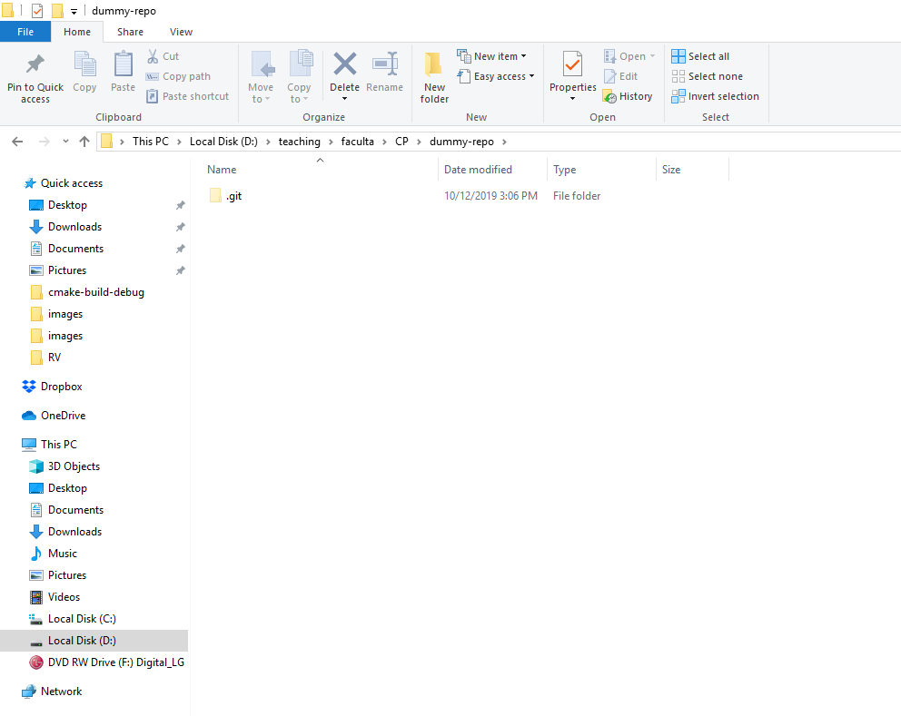
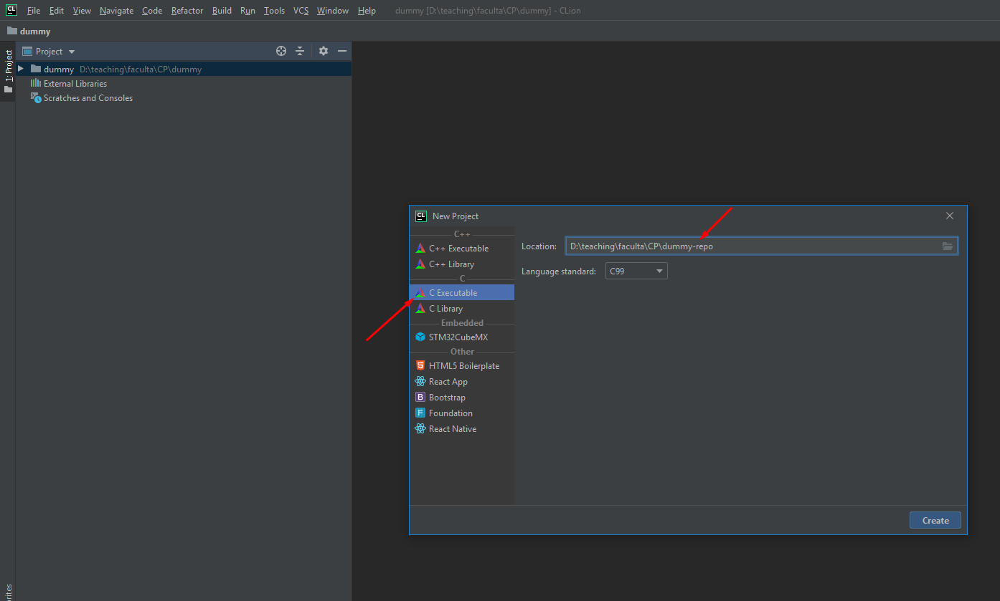
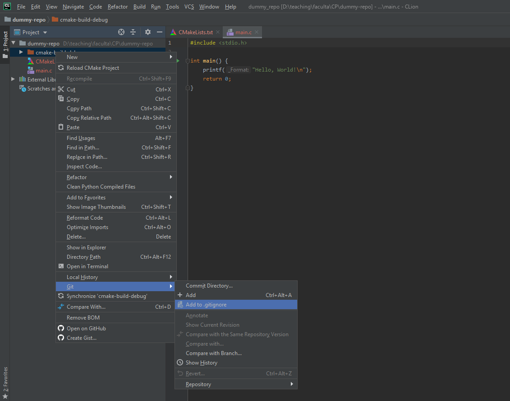
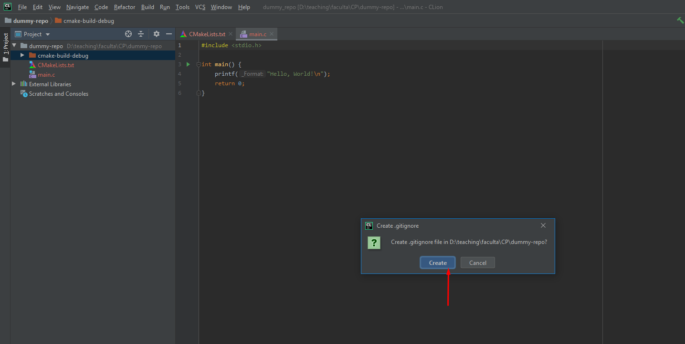
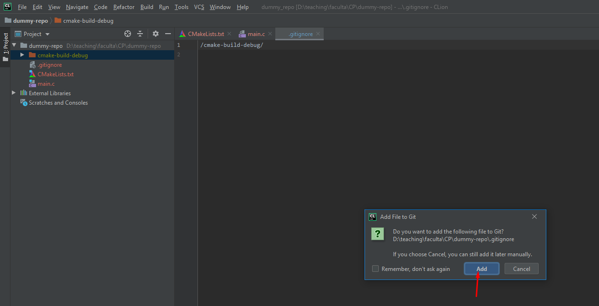
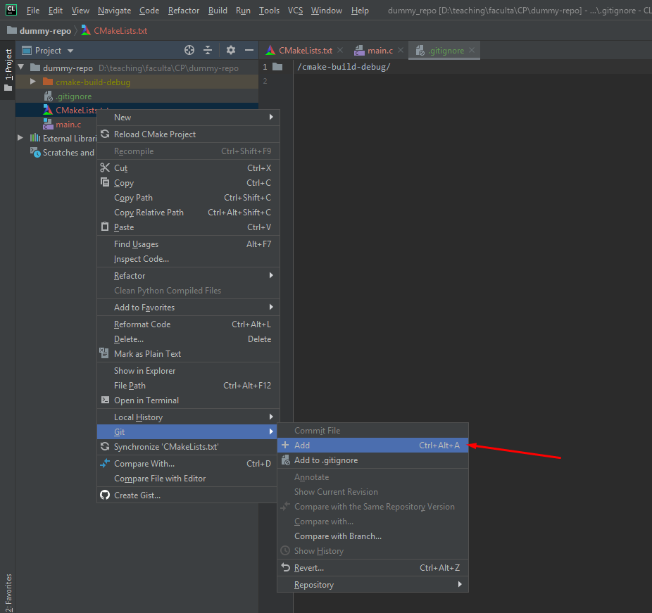
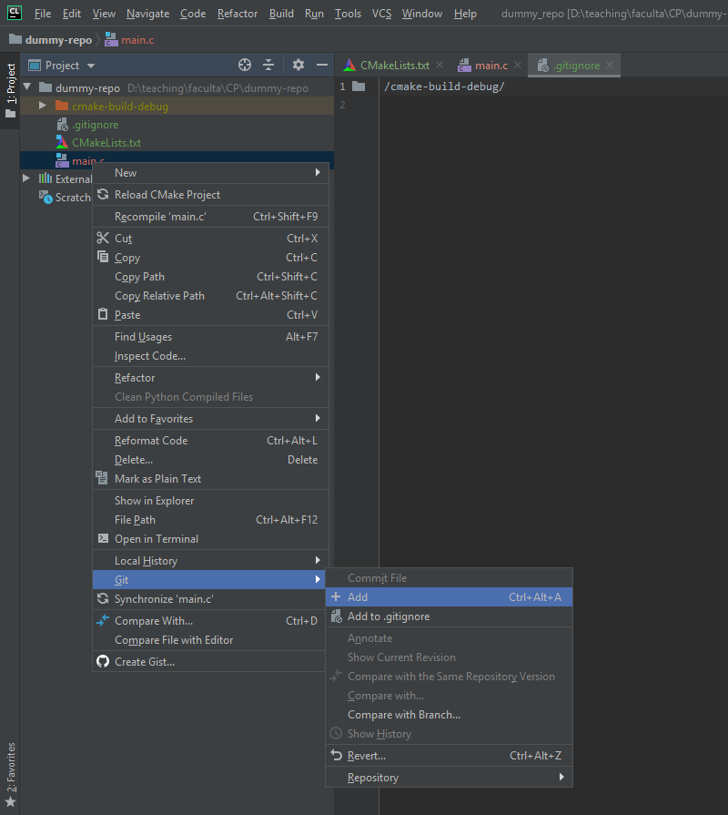
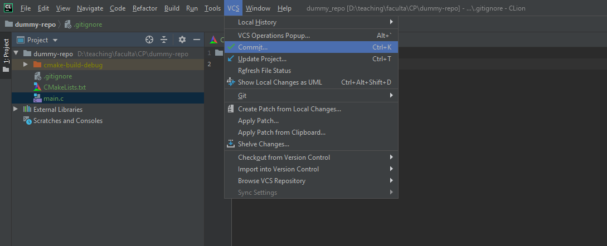
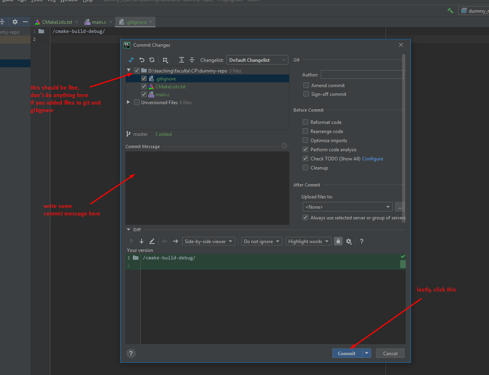
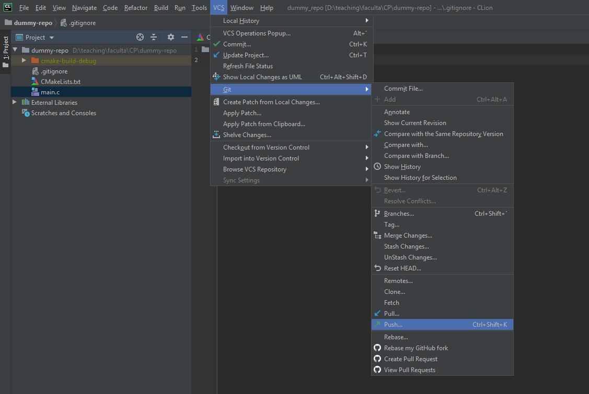

### Copy the path of the repository

### Use the copied path when creating the new project

### Ignore the `cmake-build-debug` folder

### Add the `CMakeLists.txt` and `main.c` files

### Commit

### Push

