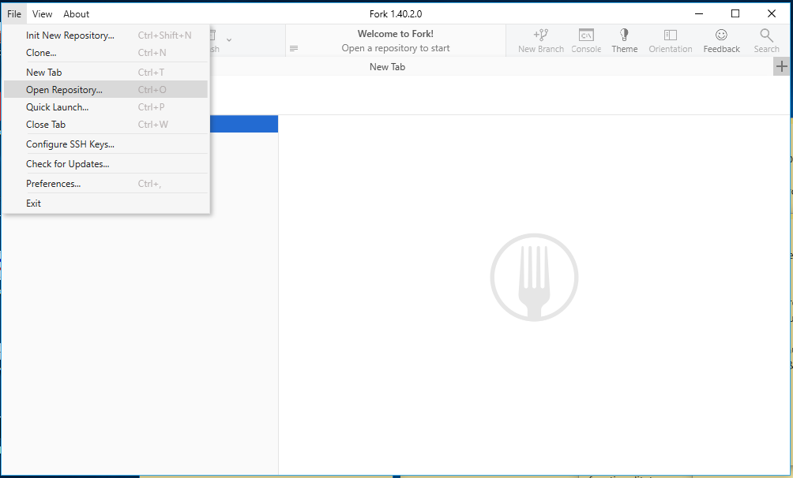
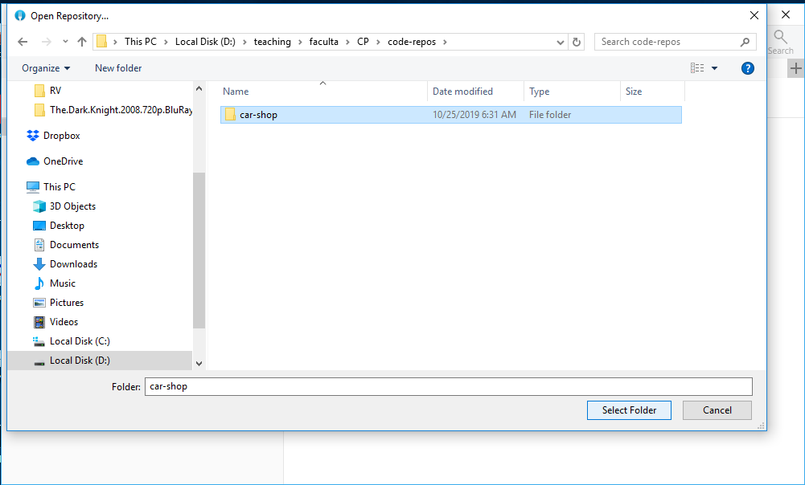
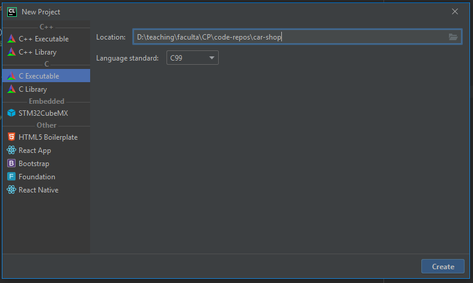
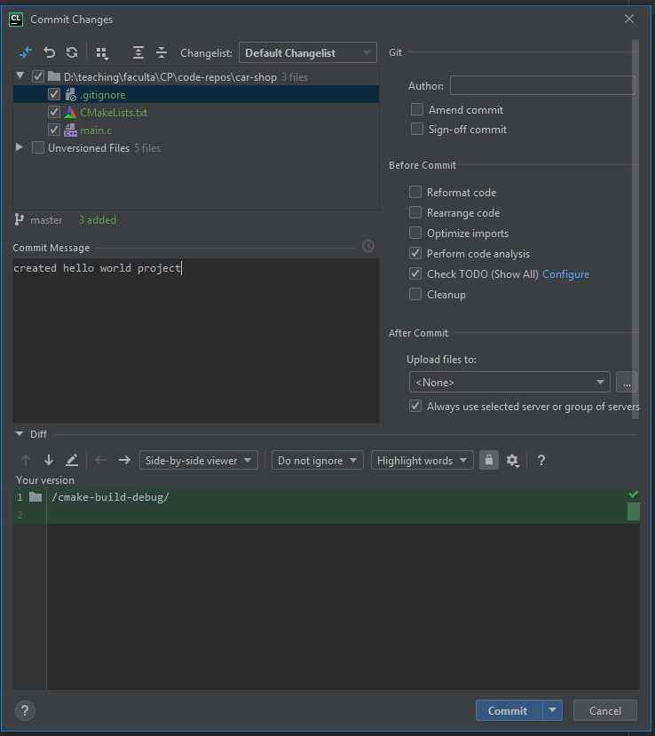
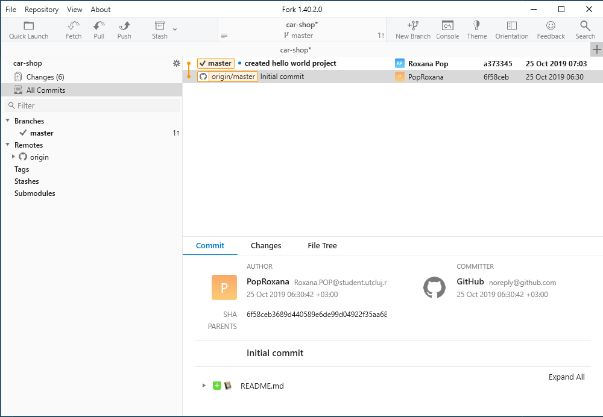
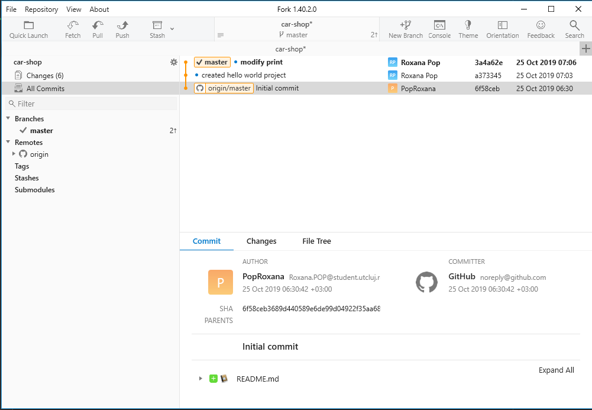
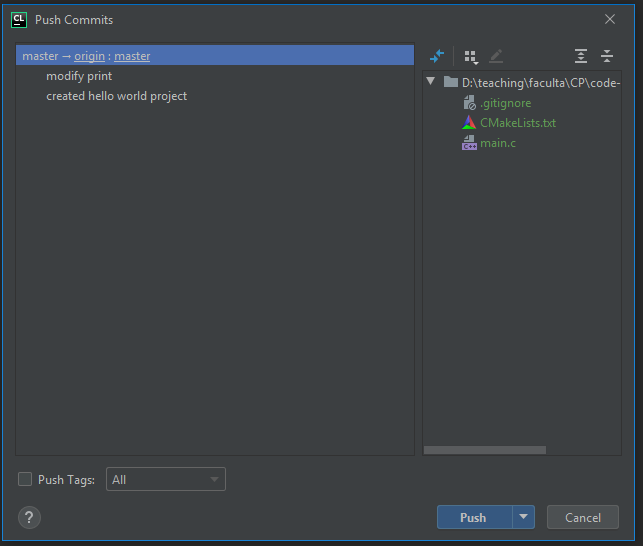
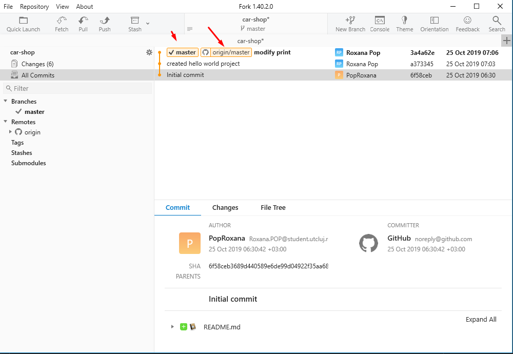

# Fork

## Download
Go here to install it:
https://git-fork.com/?fbclid=IwAR3Yy9PVuL_rdPtUoJjZRmS7U4f2IAsyD3dEtcLKdQeYHcd3S5mvuJGZP24

## Open car-shop repository in __Fork__

You should have your car-shop repository cloned locally. Once you have that, you can open the local repo (folder) from the __Fork__ git client by clicking "File > Open Repository" and selecting the car-shop folder.




## Create a C project in the car-shop folder (local repo)
We will do the development from __CLion__. If the car-shop repo is empty, create a C project in __CLion__ in your local repository. If you already created a C project in the repository, you may skip this step.


## Visualize commits in __Fork__

Now we will play around with __CLion___ and __Fork__. You have already created commits and pushed them from __CLion__. We can do that from __Fork__ as well, or we can use both tools. If we create commits from __CLion__ we should see them in Fork as well.

## Create a hello world commit
If you commit your changes after creating the C project from __CLion__  under the message `created hello world project`:


You can see the `created hello world project` commit in __Fork__. What's more, you can see what you have on your local repo (`master`) and what you have on your remote repo (`origin master`).

## Create a second commit
Now change the hello world message
```c
printf("Hello, world!\n");
```
to the following message:
```c
printf("Welcome to our car shop. Press 'ESC' to exit\n");
```
Create a commit named `add welcome message` from __CLion__


From Fork you should now see the second commit (`add welcome message`) stacked on top of the previous commit (`created hello world project`)


## Push from __CLion__ and visualize in __Fork__

If you push your changes from __CLion__ that means your commits in the local repo will reach the remote repo.

That is, the `master` branch and the `origin master` branch will be at the same commit, which can be visualized in __Fork__



