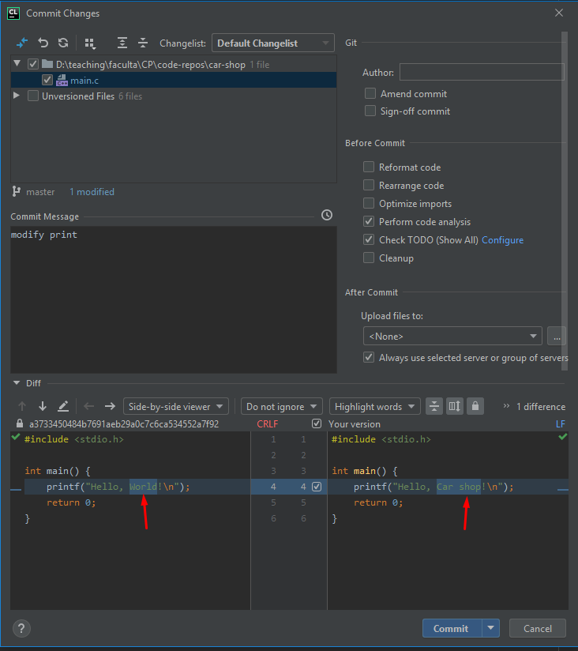

# Fork

## Download
Go here to install it:
https://git-fork.com/?fbclid=IwAR3Yy9PVuL_rdPtUoJjZRmS7U4f2IAsyD3dEtcLKdQeYHcd3S5mvuJGZP24

## Open car-shop repository in Fork

You should have your car-shop repository cloned locally. Once you have that, you can open the local repo (folder) from the Fork git client by clicking "File > Open Repository" and selecting the car-shop folder.

## Create a C project in the car-shop folder (local repo)
We will do the development from CLion. If the car-shop repo is empty, create a C project in CLion in your local repository. If you already created a C project in the repository, you may skip this step.

## Visualize commits in Fork

Now we will play around with CLion and Fork. You have already created commits and pushed them from CLion. We can do that from Fork as well, or we can use both tools. If we create commits from CLion we should see them in Fork as well.

## Create a hello world commit
If you commit your changes after creating the C project from CLion  under the message `created hello world project`:

You can see the `created hello world project` commit in __Fork__. What's more, you can see what you have on your local repo (`master`) and what you have on your remote repo (`origin master`).

## Push from CLion and visualize in Fork

