# Create a dev branch
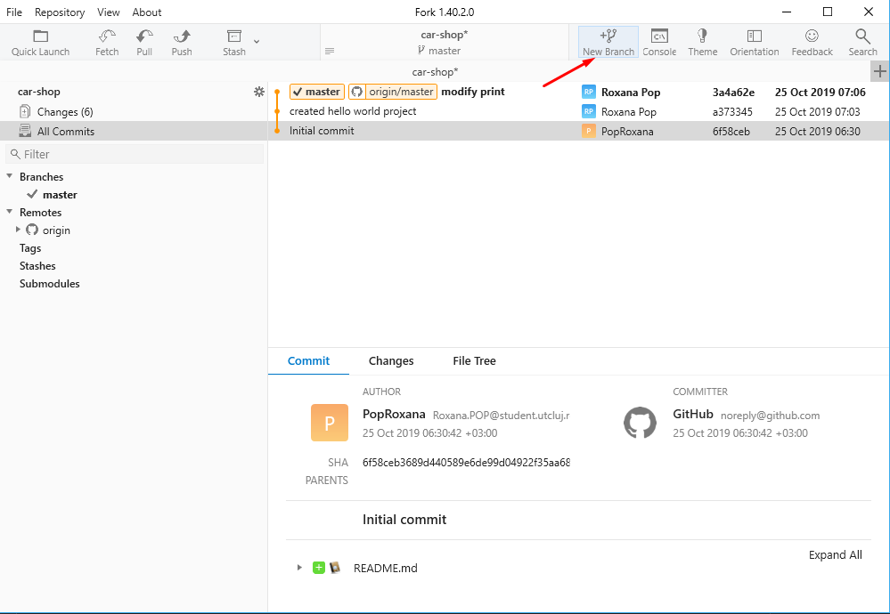
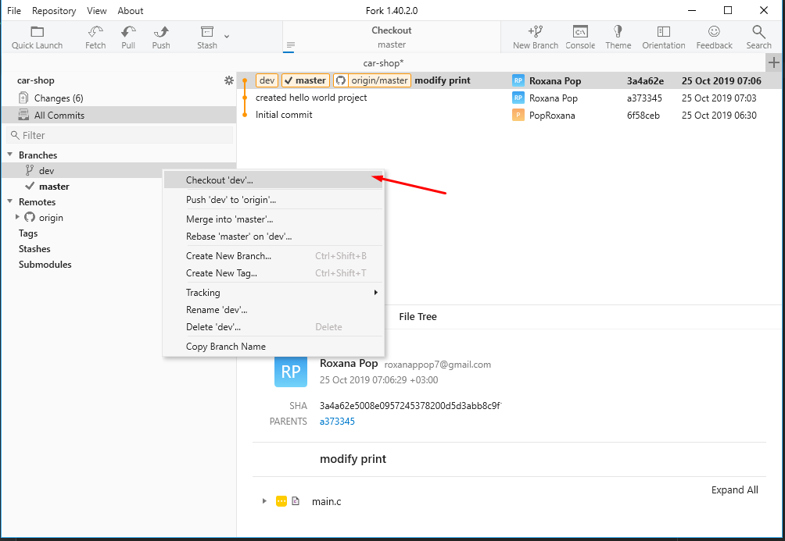

# Commit to the dev branch
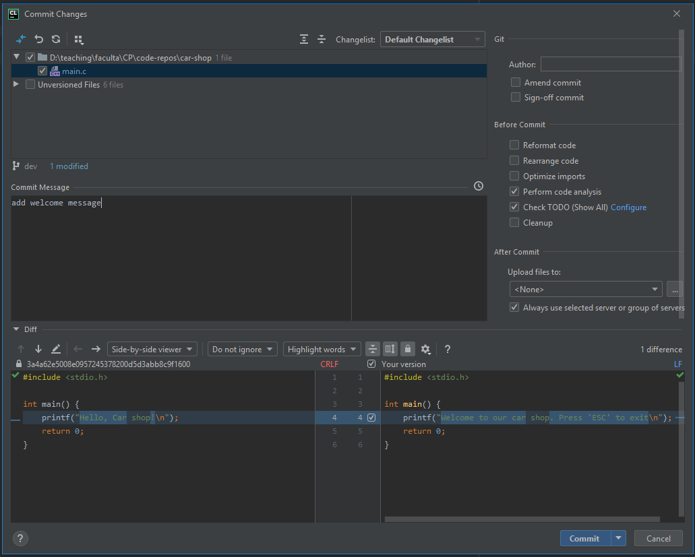
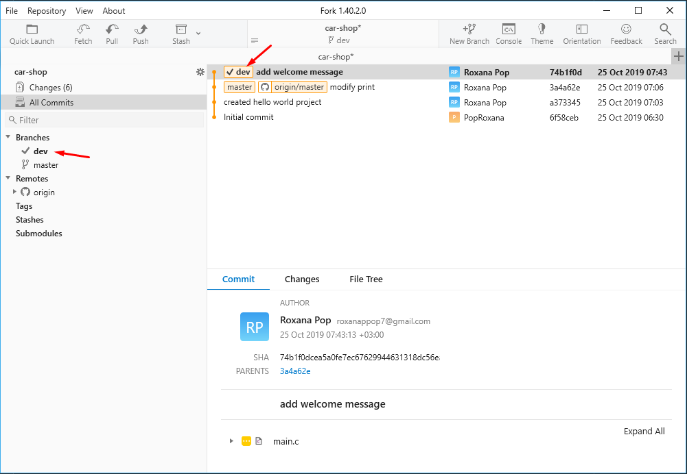

# Push from dev branch
## Push from CLion
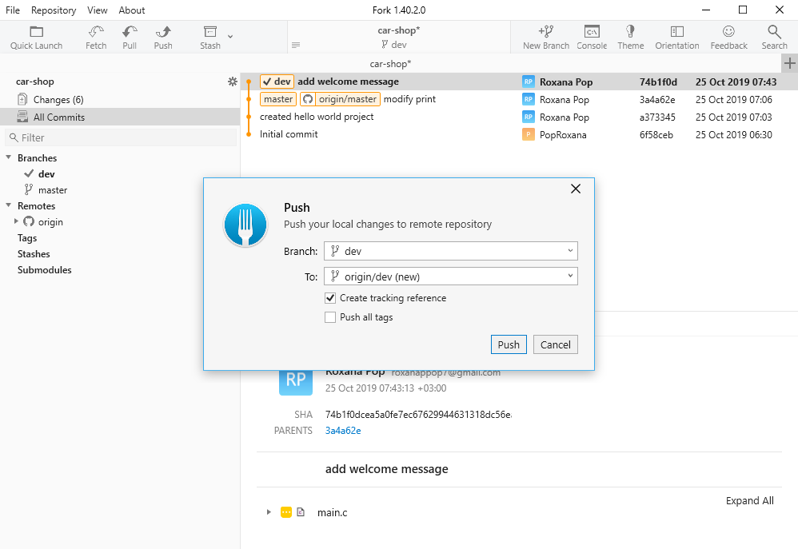
## Go on your GitHub repo to see the branches there
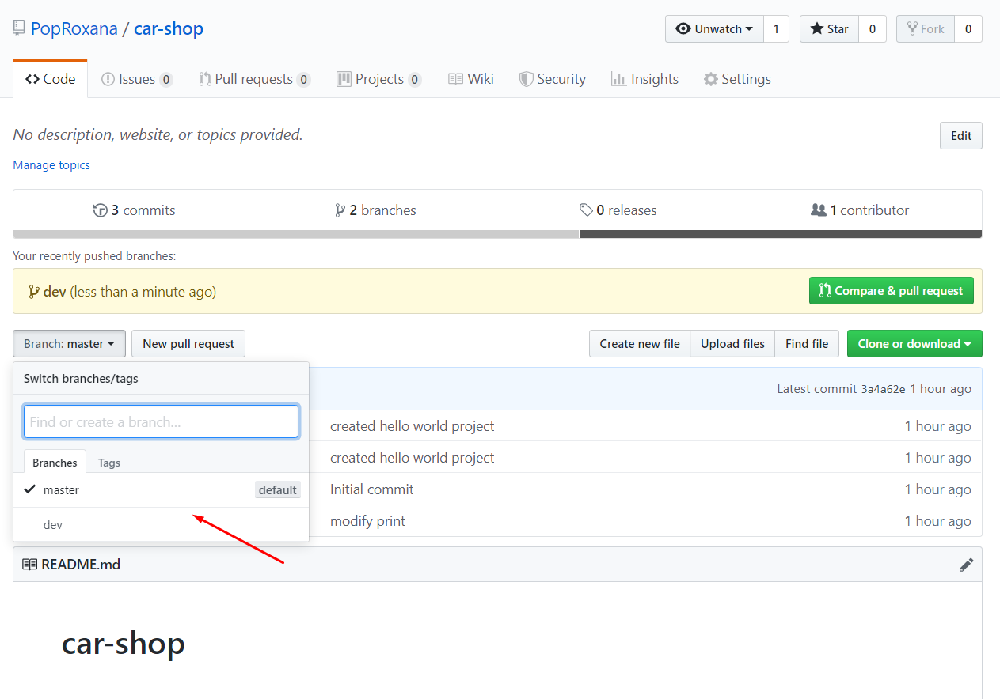

# Create a pull request

## Add 'ranapop' as a reviewer
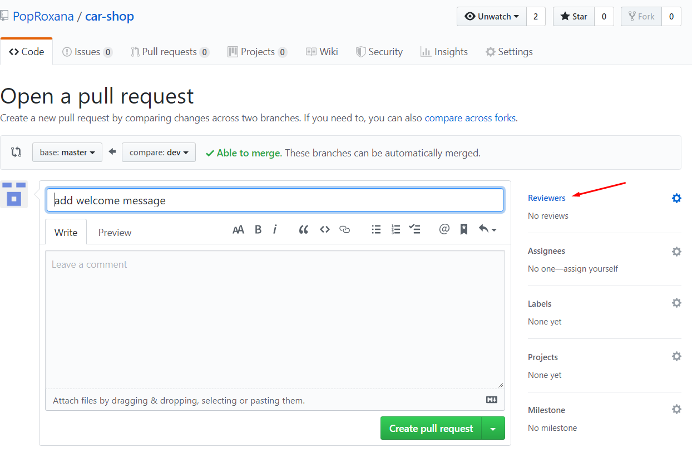
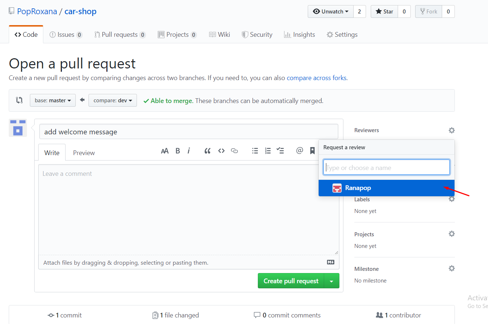

## Add a comment
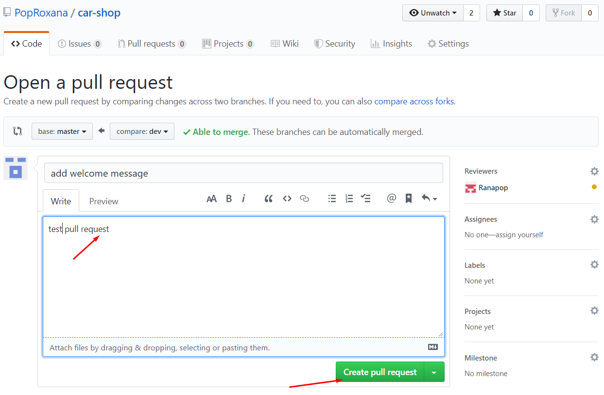

# Wait for a review

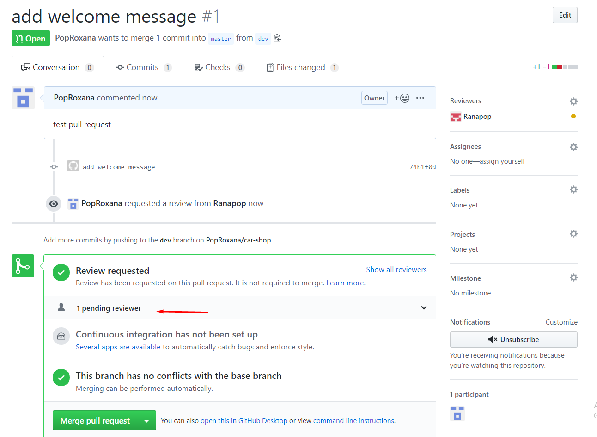

# Changes merged

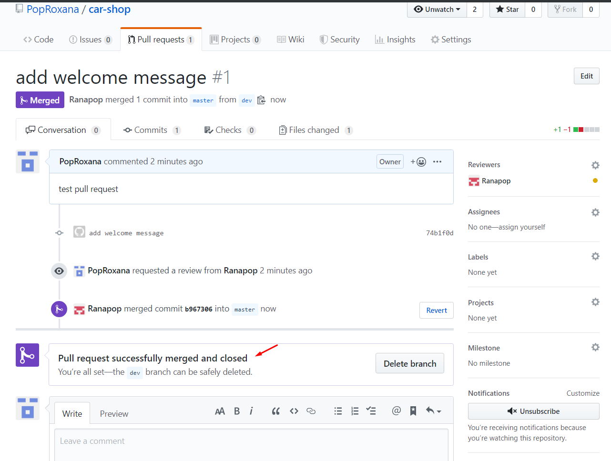

