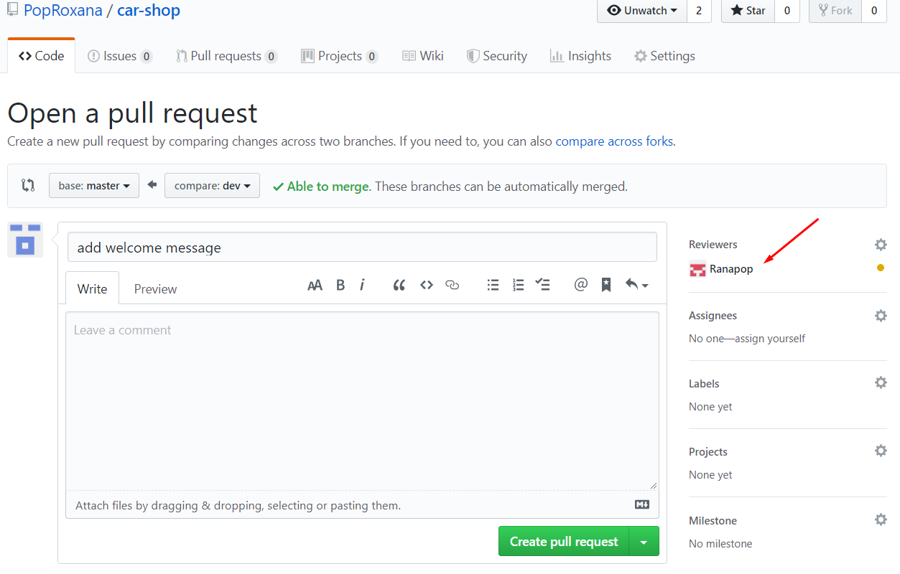

# Create a dev branch

# Commit to the dev branch

# Push from dev branch
## Push from CLion

## Go on your GitHub repo to see the branches there

# Create a pull request

## Add 'ranapop' as a reviewer

## Add a comment

# Wait for a review

# Changes merged

