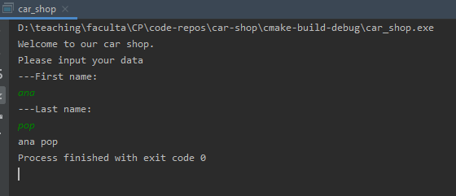
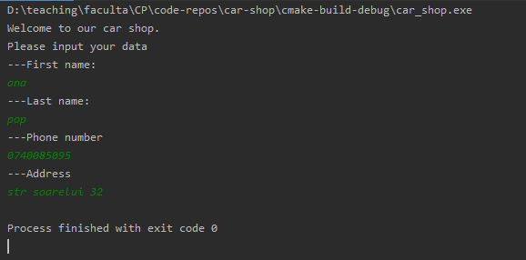
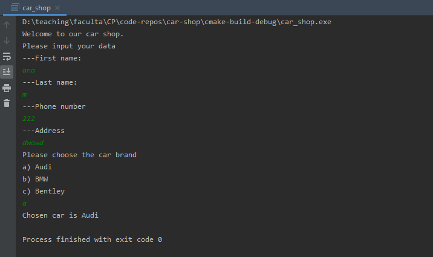
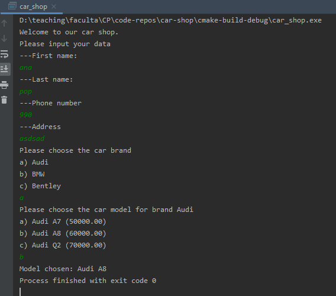
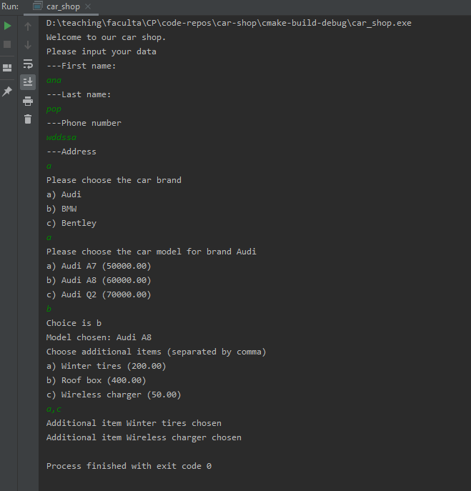
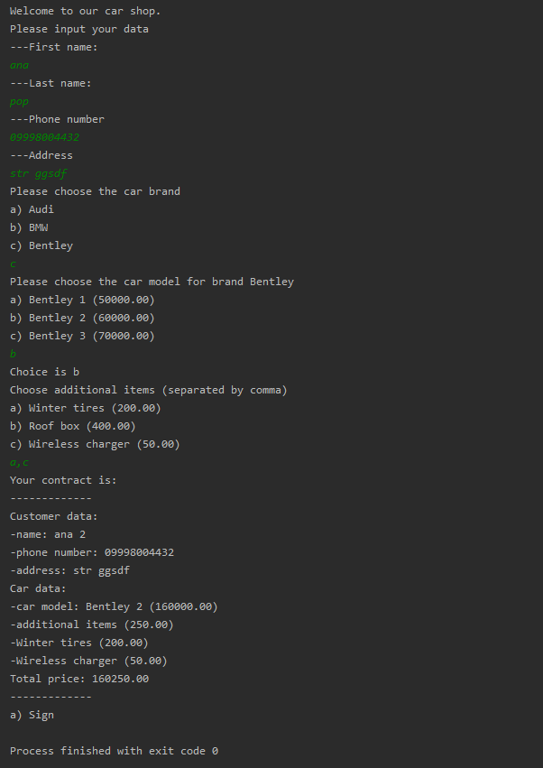

# Desired flow:
```
Welcome to our car shop. Press 'q' to exit.
Please input your data.
---First Name
>Ana
---Last Name
>Pop
---Phone number
>074c3210dd
!Your phone number must contain only numbers
---Phone number
>0744321022
---Address
Str. Luna nr 21

Please choose the car brand
a) Audi
b) BMW
c) Bentley
->a

Please choose the model for brand Audi
a) Audi A7(50000)
b) Audi A8(60000)
c) Audi Q2(70000)
d) Go back
->a

Choose additional items (separated by comma)
a) Winter tires (200)
b) Roof box (400)
c) Wireless charger (50)
d) Go back
->a,c

Your contract is:
-------------
Customer data:
-name: Ana Pop
-phone number: 0744321022
-address: Str. Luna nr 21
Car data:
-car model: Audi A7 (50000)
-additional items (250)
--winter tires (200)
--wireless charger (50)
Total price: 50250
-------------
a) Sign
b) Go back
```

# Reading the name



```c
#include <stdio.h>

int main() {
    printf("Welcome to our car shop.\n");


    // Input personal data
    char firstName[20];
    char lastName[20];
    printf("Please input your data\n");
    printf("---First name:\n");
    gets(firstName);
    printf("---Last name:\n");
    gets(lastName);
    
    //test name
    printf("%s %s", firstName, lastName);

    return 0;
}
```

# Reading personal data (no validation)



```c
// Input personal data
char firstName[20];
char lastName[20];
char phoneNumber[10];
char address[30];
printf("Please input your data\n");
printf("---First name:\n");
gets(firstName);
printf("---Last name:\n");
gets(lastName);
printf("---Phone number\n");
gets(phoneNumber);
printf("---Address\n");
gets(address);
```

# Choose car brand



```c
// Choose the brand
char brands[][10] = {"Audi","BMW","Bentley"};
printf("Please choose the car brand\n");
for(int i=0;i<3;i++) {
    putchar('a'+i);
    printf(") %s\n",brands[i]);
}
char choice = getchar();
int brandChoice = choice - 'a';
printf("Chosen car is %s\n",brands[brandChoice]);
```

# Choose car model



```c
// Choose the car model
printf("Please choose the car model for brand %s\n",brands[brandChoice]);
switch(brandChoice) {
    // Audi
    case 0: {
        char models[][10] = {"Audi A7", "Audi A8", "Audi Q2"};
        double prices[] = {50000, 60000, 70000};
        for(int i=0;i<3;i++) {
            putchar('a'+i);
            printf(") %s (%.2f)\n",models[i],prices[i]);
        }
        // consume new line
        getchar();
        choice = getchar();
        int modelChoice = choice - 'a';
        printf("Model chosen: %s", models[modelChoice]);
        break;
    }
    case 1: {
        printf("No models\n");
        break;
    }
    case 2: {
        printf("No models\n");
        break;
    }
}
```

Expand the code to be able to choose models for all of the three brands + store the choice outside of the for statement:
```c
// Choose the car model
char models[3][3][10] = {
        {"Audi A7", "Audi A8", "Audi Q2"},
        {"BMW 1", "BMW 2", "BMW 3"},
        {"Bentley 1", "Bentley 2", "Bentley 3"}
};
double prices[3][3] = {
        {50000, 60000, 70000},
        {50001, 60002, 70003},
        {150000, 160000, 170000}
};
printf("Please choose the car model for brand %s\n",brands[brandChoice]);
switch(brandChoice) {
    // Audi
    case 0: {
        for(int i=0;i<3;i++) {
            putchar('a'+i);
            printf(") %s (%.2f)\n",models[0][i], prices[0][i]);
        }
        break;
    }
    case 1: {
        for(int i=0;i<3;i++) {
            putchar('a'+i);
            printf(") %s (%.2f)\n",models[1][i], prices[0][i]);
        }
        break;
    }
    case 2: {
        for(int i=0;i<3;i++) {
            putchar('a'+i);
            printf(") %s (%.2f)\n",models[2][i], prices[0][i]);
        }
        break;
    }
}
// consume new line
getchar();
choice = getchar();
printf("Choice is %c\n",choice);
int modelChoice = choice - 'a';
```


# Chose additional items



```c
//read additional items
int chosenAdditionalItems[3];
// consume new line
getchar();
int noAddItemsChosen = 0;
//we want to check here for '\n' to allow the user to select 0 additional items
while ((choice = getchar())!='\n') {
    chosenAdditionalItems[noAddItemsChosen] = choice - 'a';
    noAddItemsChosen++;
    //read comma
    char comma = getchar();
    if(comma=='\n'){
        //after the last letter, a new line entered
        break;
    }
}

//test additional items
for(int i=0;i<noAddItemsChosen;i++) {
    printf("Additional item %s chosen\n",additionalItems[chosenAdditionalItems[i]]);
}
```

# Displaying the contract


```c
printf("Your contract is:\n");
printf("-------------\n");
printf("Customer data:\n");
printf("-name: %s %s\n", firstName, lastName);
printf("-phone number: %s\n", phoneNumber);
printf("-address: %s\n", address);
printf("Car data:\n");
printf("-car model: %s (%.2f)\n", models[brandChoice][modelChoice], prices[brandChoice][modelChoice]);
double additionalItemsPrice = 0;
for(int i=0;i<noAddItemsChosen;i++) {
    additionalItemsPrice += additionalItemsPrices[chosenAdditionalItems[i]];
}
printf("-additional items (%.2f)\n", additionalItemsPrice);
for(int i=0;i<noAddItemsChosen;i++) {
    printf("-%s (%.2f)\n", additionalItems[chosenAdditionalItems[i]], additionalItemsPrices[chosenAdditionalItems[i]]);
}
printf("Total price: %.2f\n", prices[brandChoice][modelChoice] + additionalItemsPrice);
printf("-------------\n");
printf("a) Sign\n");
```

# Going back

Main idea: use a state variable to remember in which part of the dialog we are:
```c
int state =0;
int contractSigned = 0;
while(!contractSigned){
    switch (state) {
        case 0: {
            // Input personal data
            state++;
            break;
        }
        case 1: {
            // Choose the brand
            state++;
            break;
        }
        case 2: {
            // Choose the car model
            state++;
            break;
        }
        case 3: {
            // Choose the additional items
            state++;
            break;
        }
        case 4:{
            // Display contract
            state++;
            break;
        }
    }
}
```
First, we move the variable definitions at the beginning so they are recognized in the different switch cases:
```c
printf("Welcome to our car shop.\n");

// cars data
char brands[][10] = {"Audi","BMW","Bentley"};
char models[3][3][10] = {
        {"Audi A7", "Audi A8", "Audi Q2"},
        {"BMW 1", "BMW 2", "BMW 3"},
        {"Bentley 1", "Bentley 2", "Bentley 3"}
};
double prices[3][3] = {
        {50000, 60000, 70000},
        {50001, 60002, 70003},
        {150000, 160000, 170000}
};
char additionalItems[][30] = {"Winter tires","Roof box","Wireless charger"};
double additionalItemsPrices[] = {200, 400, 50};

//user input
char firstName[20];
char lastName[20];
char phoneNumber[10];
char address[30];
int choice, brandChoice, modelChoice;
int noAddItemsChosen = 0;
int chosenAdditionalItems[3];
```

Then, move the code in the switch branches:
```c
int state =0;
int contractSigned = 0;
while(!contractSigned){
    switch (state) {
        case 0: {
            // Input personal data
            printf("Please input your data\n");
            printf("---First name:\n");
            gets(firstName);
            printf("---Last name:\n");
            gets(lastName);
            printf("---Phone number\n");
            gets(phoneNumber);
            printf("---Address\n");
            gets(address);
            state++;
            break;
        }
        case 1: {
            // Choose the brand
            printf("Please choose the car brand\n");
            for(int i=0;i<3;i++) {
                putchar('a'+i);
                printf(") %s\n",brands[i]);
            }
            char choice = getchar();
            int brandChoice = choice - 'a';
            // Choose the car model
            state++;
            break;
        }
        case 2: {
            // Choose the car model
            printf("Please choose the car model for brand %s\n",brands[brandChoice]);
            switch(brandChoice) {
                // Audi
                case 0: {
                    for(int i=0;i<3;i++) {
                        putchar('a'+i);
                        printf(") %s (%.2f)\n",models[0][i], prices[0][i]);
                    }
                    break;
                }
                case 1: {
                    for(int i=0;i<3;i++) {
                        putchar('a'+i);
                        printf(") %s (%.2f)\n",models[1][i], prices[0][i]);
                    }
                    break;
                }
                case 2: {
                    for(int i=0;i<3;i++) {
                        putchar('a'+i);
                        printf(") %s (%.2f)\n",models[2][i], prices[0][i]);
                    }
                    break;
                }
            }
            // consume new line
            getchar();
            choice = getchar();
            printf("Choice is %c\n",choice);
            int modelChoice = choice - 'a';
            state++;
            break;
        }
        case 3: {
            // Choose the additional items
            // Choose the additional items
            printf("Choose additional items (separated by comma)\n");
            for(int i=0;i<3;i++) {
                putchar('a'+i);
                printf(") %s (%.2f)\n", additionalItems[i], additionalItemsPrices[i]);
            }
            //read additional items
            // consume new line
            getchar();
            //we want to check here for '\n' to allow the user to select 0 additional items
            while ((choice = getchar())!='\n') {
                chosenAdditionalItems[noAddItemsChosen] = choice - 'a';
                noAddItemsChosen++;
                //read comma
                char comma = getchar();
                if(comma=='\n'){
                    //after the last letter, a new line entered
                    break;
                }
            }

            state++;
            break;
        }
        case 4:{
            // Display contract
            printf("Your contract is:\n");
            printf("-------------\n");
            printf("Customer data:\n");
            printf("-name: %s %s\n", firstName, lastName);
            printf("-phone number: %s\n", phoneNumber);
            printf("-address: %s\n", address);
            printf("Car data:\n");
            printf("-car model: %s (%.2f)\n", models[brandChoice][modelChoice], prices[brandChoice][modelChoice]);
            double additionalItemsPrice = 0;
            for(int i=0;i<noAddItemsChosen;i++) {
                additionalItemsPrice += additionalItemsPrices[chosenAdditionalItems[i]];
            }
            printf("-additional items (%.2f)\n", additionalItemsPrice);
            for(int i=0;i<noAddItemsChosen;i++) {
                printf("-%s (%.2f)\n", additionalItems[chosenAdditionalItems[i]], additionalItemsPrices[chosenAdditionalItems[i]]);
            }
            printf("Total price: %.2f\n", prices[brandChoice][modelChoice] + additionalItemsPrice);
            printf("-------------\n");
            printf("a) Sign\n");
            state++;
            contractSigned = 1;
            break;
        }
    }
}
```

