# Extracting functions

## Overview
* [Extracting inputPersonalData](#Extracting-inputPersonalData)
* [Extracting displayBrandOptions](#Extracting-displayBrandOptions)
* [Extracting displayModelOptions](#Extracting-displayModelOptions)
* [Extracting chooseCarModel](#Extracting-chooseCarModel)
* [Extracting functions for handling additional items](#Extracting-functions-for-handling-additional-items)
* [Extracting chooseCarModel](#Extracting-functions-for-handling-the-contract)
* [Recap](#Recap)

## Extracting inputPersonalData

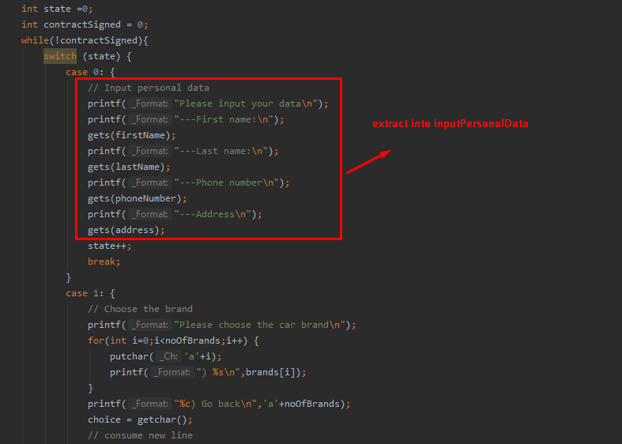

This is the function implementation. The data that we want to read is sent as parameters. 

```c
void inputPersonalData(char firstName[], char lastName[], char phoneNumber[], char address[]) {
    // Input personal data
    printf("Please input your data\n");
    printf("---First name:\n");
    gets(firstName);
    printf("---Last name:\n");
    gets(lastName);
    printf("---Phone number\n");
    gets(phoneNumber);
    printf("---Address\n");
    gets(address);
}
```

We will call this function in our switch statement:

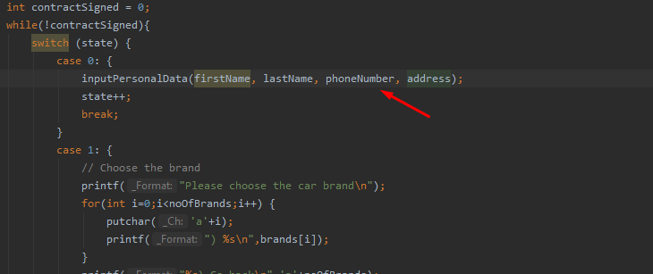

If we define `inputPersonalData` bellow our main, we need to declare it above the main function, so we can use it inside the main function:
This is the declaration:
```c
void inputPersonalData(char firstName[], char lastName[], char phoneNumber[], char address[]);
```

And we will place it here:


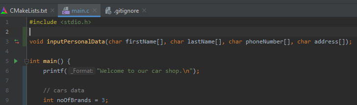

## Extracting displayBrandOptions

We can extract displaying the brand options:

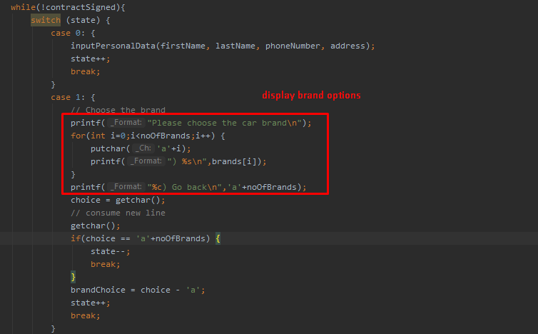

```c
void displayBrandOptions(int noOfBrands, char brands[][10]) {
    // Choose the brand
    printf("Please choose the car brand\n");
    for(int i=0;i<noOfBrands;i++) {
        putchar('a'+i);
        printf(") %s\n",brands[i]);
    }
    printf("%c) Go back\n",'a'+noOfBrands);
}
```

We declare it below the other function, thus having:
```c
#include <stdio.h>

void inputPersonalData(char firstName[], char lastName[], char phoneNumber[], char address[]);
void displayBrandOptions(int noOfBrands, char brands[][10]);
```

The second case of the switch statement becomes:
```c
case 1: {
    // Choose the brand
    displayBrandOptions(noOfBrands,brands);
    choice = getchar();
    // consume new line
    getchar();
    if(choice == 'a'+noOfBrands) {
        state--;
        break;
    }
    brandChoice = choice - 'a';
    state++;
    break;
}
```

### Defining some constants

We can see that we had to pass `10` as max size of brand name in this function. And we also did it when defining the brands array of string in the main function. It's hard to keep track like that. And if we wanted to say the brand names should be as much as 20 characters, we would have to change that in a few places. So let's define the max brand name length as a constant:
```c
#define MAX_BRAND_NAME 10
```
Let's use it in the function header:
```c
void displayBrandOptions(int noOfBrands, char brands[][MAX_BRAND_NAME]);
```
And in the declaration of brands in main:
```c

char brands[][MAX_BRAND_NAME] = {"Audi","BMW","Bentley"};
```

## Extracting displayModelOptions

We can do the same thing for displaying the model options. We can extract this part of the code from the `case 2` of the switch statement:
```c
 // Choose the car model
printf("Please choose the car model for brand %s\n",brands[brandChoice]);
for(int i=0;i<noModels[brandChoice];i++) {
    putchar('a'+i);
    printf(") %s (%.2f)\n",models[brandChoice][i], prices[brandChoice][i]);
}
printf("%c) Go back\n",'a'+noModels[brandChoice]);
```
Move it into a function (where we don't send the whole data, just the data at index `brandChoice`):
```c
void displayModelOptions(int noOfModels, char brand[], char models[][MAX_MODEL_NAME], double prices[]) {
    // Choose the car model
    printf("Please choose the car model for brand %s\n",brand);
    for(int i=0;i<noOfModels;i++) {
        putchar('a'+i);
        printf(") %s (%.2f)\n",models[i], prices[i]);
    }
    printf("%c) Go back\n",'a'+noOfModels);
}
```
We move the header of the function above main:
```c
void displayModelOptions(int noOfModels, char brand[], char models[][MAX_MODEL_NAME], double prices[])
```
Then call it inside the switch statement:

And now our code looks like this:

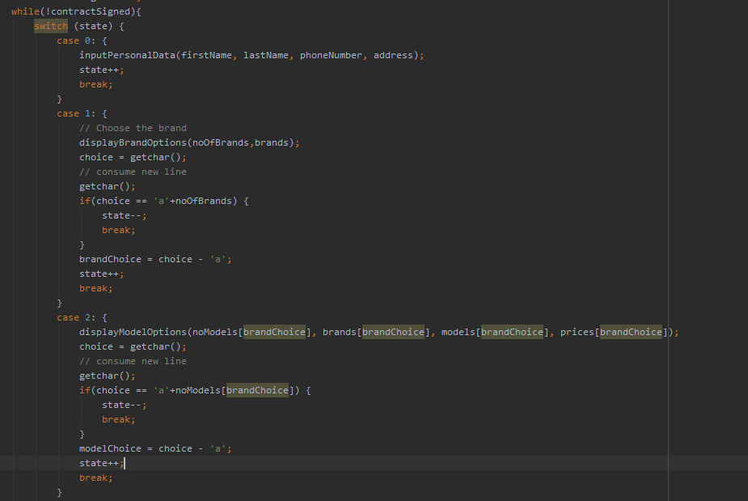

## Extracting getChoiceIndex

Now we can see that reading the choice and converting it to an index is quite repetitive:

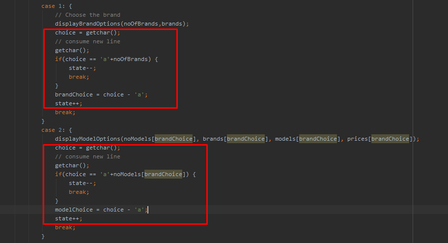

We can therefore extract that code in a function. Before doing that we must get rid of that break statement. We can avoid it by using __if else__:
```c
choice = getchar();
// consume new line
getchar();
if(choice == 'a'+noOfBrands) {
    state--;
} else {
    brandChoice = choice - 'a';
    state++;
}
break;
```
Then, we can move the code to a function. Be aware that in order to modify the state variable when sending it as a parameter, we will have to use __pass by reference__. Our function will be:
```c
int getChoiceIndex(int noOfChoices, int *state) {
    int choiceIndex;
    char choice = getchar();
    // consume new line
    getchar();
    if(choice == 'a'+noOfChoices) {
        (*state)--; // *state-- <=> *(state--)
    } else {
        choiceIndex = choice - 'a';
        (*state)++;
    }
    return choiceIndex;
}
```

We declare the function at the top with the other functions, thus having:
```c
void inputPersonalData(char firstName[], char lastName[], char phoneNumber[], char address[]);
void displayBrandOptions(int noOfBrands, char brands[][MAX_BRAND_NAME]);
void displayModelOptions(int noOfModels, char brand[], char models[][MAX_MODEL_NAME], double prices[]);
int getChoiceIndex(int noOfChoices, int *state);
```

Then we call the function like this:

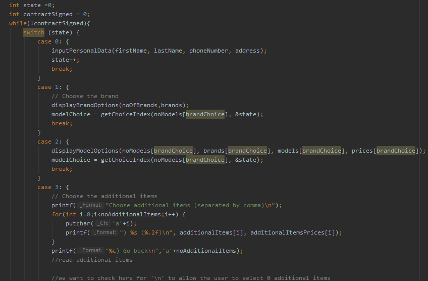


## Extracting chooseCarModel

We will extract this code:

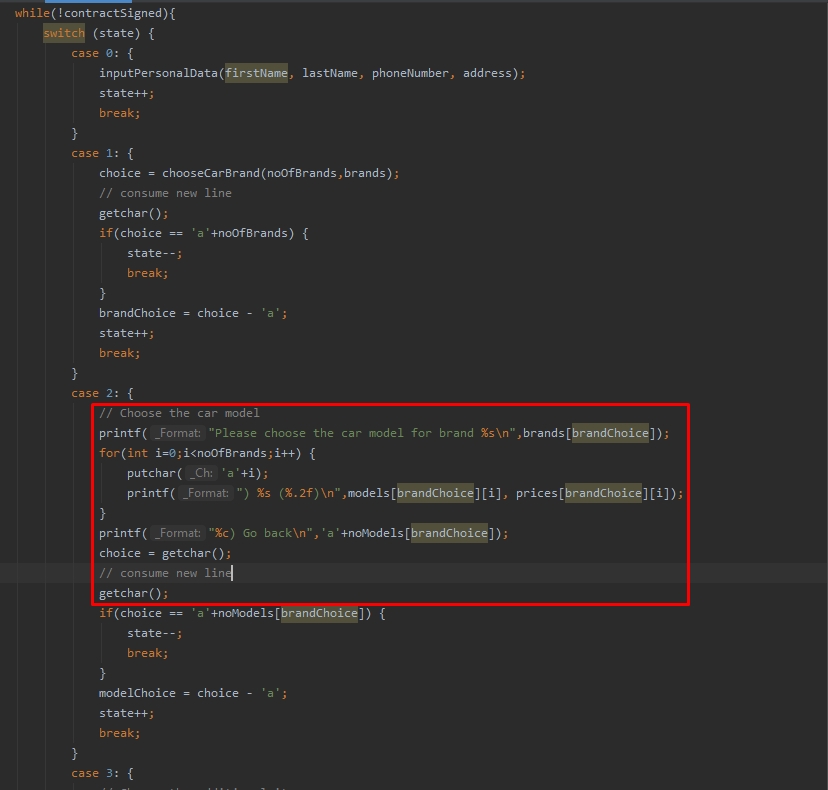

Into this function:

```c
char chooseCarModel(int noOfModels, char models[][MAX_MODEL_NAME], double prices[], char brand[]){
    printf("Please choose the car model for brand %s\n",brand);
    for(int i=0;i<noOfModels;i++) {
        putchar('a'+i);
        printf(") %s (%.2f)\n",models[i], prices[i]);
    }
    printf("%c) Go back\n",'a'+noOfModels);
    char choice = getchar();
    // consume new line
    getchar();
    return choice;
}
```

Put the declaration with the other declarations:
```c
void inputPersonalData(char firstName[], char lastName[], char phoneNumber[], char address[]);
char chooseCarBrand(int noOfBrands, char brands[][MAX_BRAND_NAME]);
char chooseCarModel(int noOfModels, char models[][MAX_MODEL_NAME], double prices[], char brand[]);
```
Then we will call it like this

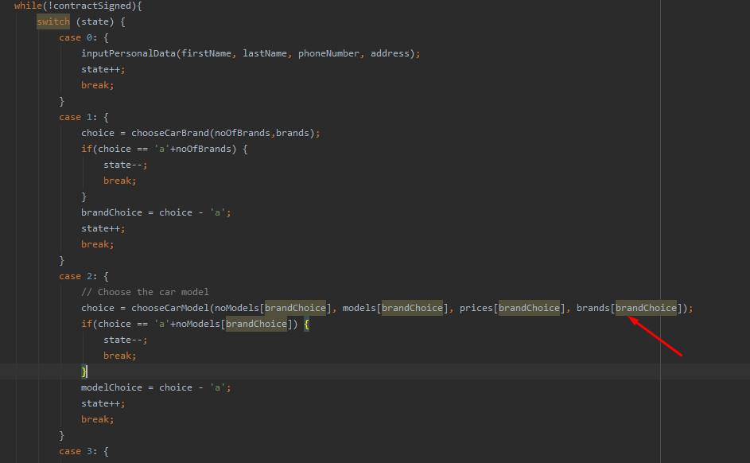

## Extracting functions for handling additional items

We can extract at least two functions from the additional items step:

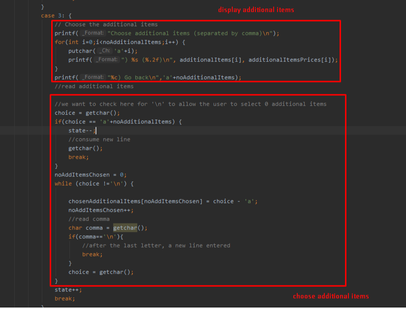

The two functions are:
```c
void printAdditionalItemsChoices(int noAdditionalItems, char additionalItems[][MAX_ADDITIONAL_ITEM_NAME], double additionalItemsPrices[]) {
    // Choose the additional items
    printf("Choose additional items (separated by comma)\n");
    for (int i = 0; i < noAdditionalItems; i++) {
        putchar('a' + i);
        printf(") %s (%.2f)\n", additionalItems[i], additionalItemsPrices[i]);
    }
    printf("%c) Go back\n", 'a' + noAdditionalItems);
}

int chooseAdditionalItems(int chosenAdditionalItems[], char firstChoice) {
    int noAddItemsChosen = 0;
    char choice = firstChoice;
    while (choice !='\n') {

        chosenAdditionalItems[noAddItemsChosen] = choice - 'a';
        noAddItemsChosen++;
        //read comma
        char comma = getchar();
        if(comma=='\n'){
            //after the last letter, a new line entered
            break;
        }
        choice = getchar();
    }
    return noAddItemsChosen;
}
```

Which can be called like:


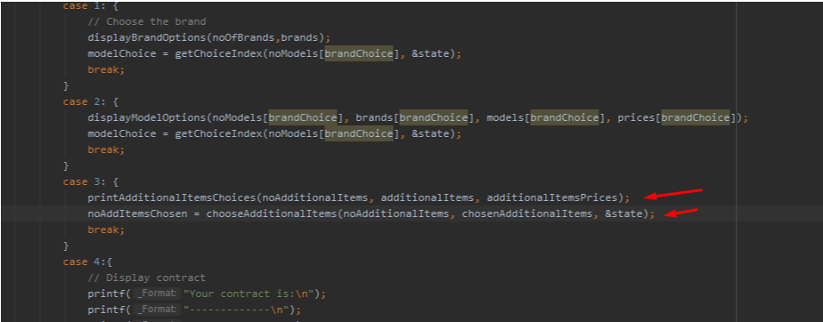

To call them like that in main, they will be declared at the top with the other functions.

## Extracting functions for handling the contract

We can extract at least two functions when displaying the contract:

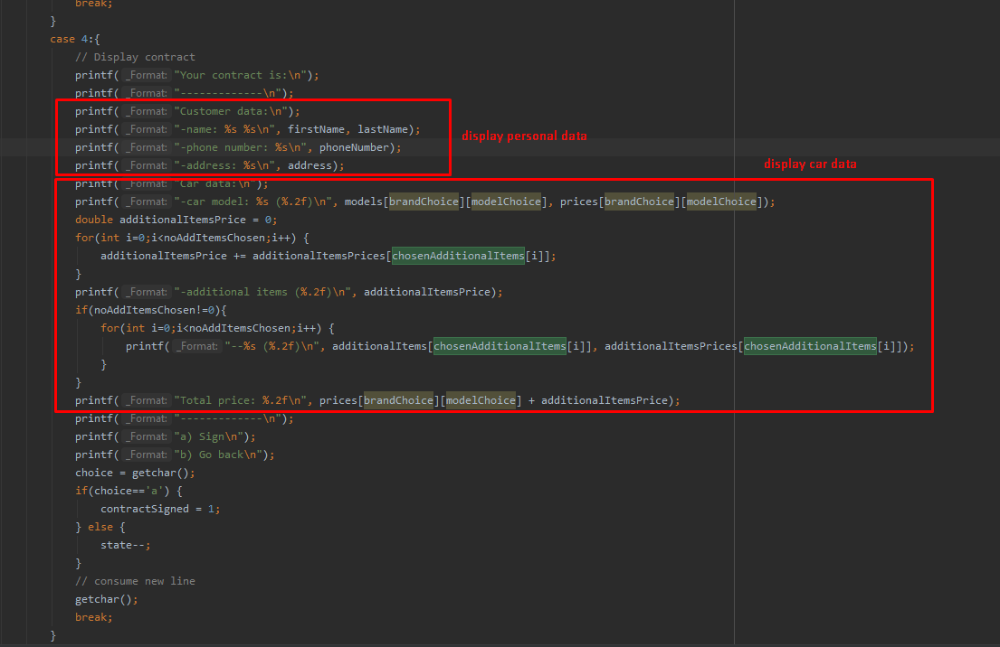

With their definition:

```c
void displayPersonalData(char firstName[], char lastName[], char phoneNumber[], char address[]) {
    printf("Customer data:\n");
    printf("-name: %s %s\n", firstName, lastName);
    printf("-phone number: %s\n", phoneNumber);
    printf("-address: %s\n", address);
}

void displayCarData(char model[], double modelPrice, int noAddItemsChosen, int chosenAdditionalItems[], char additionalItems[][MAX_ADDITIONAL_ITEM_NAME],
                    double additionalItemsPrices[]) {
    printf("Car data:\n");
    printf("-car model: %s (%.2f)\n", model, modelPrice);
    double additionalItemsPrice = 0;
    for(int i=0;i<noAddItemsChosen;i++) {
        additionalItemsPrice += additionalItemsPrices[chosenAdditionalItems[i]];
    }
    printf("-additional items (%.2f)\n", additionalItemsPrice);
    if(noAddItemsChosen!=0){
        for(int i=0;i<noAddItemsChosen;i++) {
            printf("--%s (%.2f)\n", additionalItems[chosenAdditionalItems[i]], additionalItemsPrices[chosenAdditionalItems[i]]);
        }
    }
    printf("Total price: %.2f\n", modelPrice + additionalItemsPrice);
}
```

These two functions are declared above main with the other functions:
```c
void inputPersonalData(char firstName[], char lastName[], char phoneNumber[], char address[]);
char chooseCarBrand(int noOfBrands, char brands[][MAX_BRAND_NAME]);
char chooseCarModel(int noOfModels, char models[][MAX_MODEL_NAME], double prices[], char brand[]);
void printAdditionalItemsChoices(int noAdditionalItems, char additionalItems[][MAX_ADDITIONAL_ITEM_NAME], double additionalItemsPrices[]);
int chooseAdditionalItems(int chosenAdditionalItems[], char firstChoice);
void displayPersonalData(char firstName[], char lastName[], char phoneNumber[], char address[]);
void displayCarData(char model[], double modelPrice, int noAddItemsChosen, int chosenAdditionalItems[], char additionalItems[][MAX_ADDITIONAL_ITEM_NAME],
                    double additionalItemsPrices[]);

```

Then called like this:

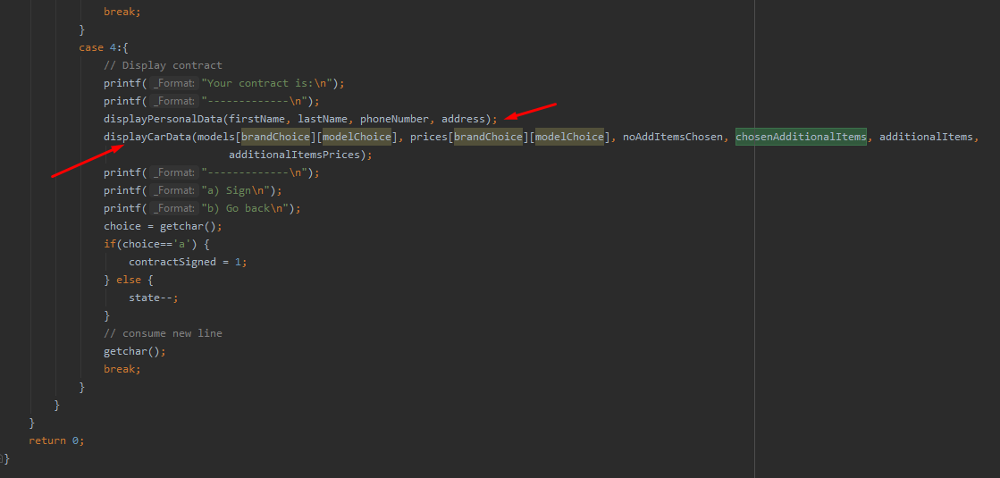

## Recap

So far we have some constants definitions:
```c
#define MAX_BRAND_NAME 10
#define MAX_MODEL_NAME 10
#define MAX_ADDITIONAL_ITEM_NAME 30
```

Functions declarartions:
```c
void inputPersonalData(char firstName[], char lastName[], char phoneNumber[], char address[]);
char chooseCarBrand(int noOfBrands, char brands[][MAX_BRAND_NAME]);
char chooseCarModel(int noOfModels, char models[][MAX_MODEL_NAME], double prices[], char brand[]);
void printAdditionalItemsChoices(int noAdditionalItems, char additionalItems[][MAX_ADDITIONAL_ITEM_NAME], double additionalItemsPrices[]);
int chooseAdditionalItems(int chosenAdditionalItems[], char firstChoice);
void displayPersonalData(char firstName[], char lastName[], char phoneNumber[], char address[]);
void displayCarData(char model[], double modelPrice, int noAddItemsChosen, int chosenAdditionalItems[], char additionalItems[][MAX_ADDITIONAL_ITEM_NAME],
                    double additionalItemsPrices[]);
```

And the refactored main function:
```c
int main() {
    printf("Welcome to our car shop.\n");

    // cars data
    int noOfBrands = 3;
    char brands[][MAX_BRAND_NAME] = {"Audi","BMW","Bentley"};
    int noModels[] = {3,3,3};
    char models[3][3][MAX_MODEL_NAME] = {
            {"Audi A7", "Audi A8", "Audi Q2"},
            {"BMW 1", "BMW 2", "BMW 3"},
            {"Bentley 1", "Bentley 2", "Bentley 3"}
    };
    double prices[3][3] = {
            {50000, 60000, 70000},
            {50001, 60002, 70003},
            {150000, 160000, 170000}
    };
    int noAdditionalItems = 3;
    char additionalItems[][MAX_ADDITIONAL_ITEM_NAME] = {"Winter tires","Roof box","Wireless charger"};
    double additionalItemsPrices[] = {200, 400, 50};

    //user input
    char firstName[20];
    char lastName[20];
    char phoneNumber[10];
    char address[30];
    int choice, brandChoice, modelChoice;
    int noAddItemsChosen = 0;
    int chosenAdditionalItems[3];

    int state =0;
    int contractSigned = 0;
    while(!contractSigned){
        switch (state) {
            case 0: {
                inputPersonalData(firstName, lastName, phoneNumber, address);
                state++;
                break;
            }
            case 1: {
                choice = chooseCarBrand(noOfBrands,brands);
                if(choice == 'a'+noOfBrands) {
                    state--;
                    break;
                }
                brandChoice = choice - 'a';
                state++;
                break;
            }
            case 2: {
                // Choose the car model
                choice = chooseCarModel(noModels[brandChoice], models[brandChoice], prices[brandChoice], brands[brandChoice]);
                if(choice == 'a'+noModels[brandChoice]) {
                    state--;
                    break;
                }
                modelChoice = choice - 'a';
                state++;
                break;
            }
            case 3: {
                printAdditionalItemsChoices(noAdditionalItems, additionalItems, additionalItemsPrices);

                //we want to check here for '\n' to allow the user to select 0 additional items
                choice = getchar();
                if(choice == 'a'+noAdditionalItems) {
                    state--;
                    //consume new line
                    getchar();
                    break;
                }
                noAddItemsChosen = chooseAdditionalItems(chosenAdditionalItems, choice);

                state++;
                break;
            }
            case 4:{
                // Display contract
                printf("Your contract is:\n");
                printf("-------------\n");
                displayPersonalData(firstName, lastName, phoneNumber, address);
                displayCarData(models[brandChoice][modelChoice], prices[brandChoice][modelChoice], noAddItemsChosen, chosenAdditionalItems, additionalItems,
                                    additionalItemsPrices);
                printf("-------------\n");
                printf("a) Sign\n");
                printf("b) Go back\n");
                choice = getchar();
                if(choice=='a') {
                    contractSigned = 1;
                } else {
                    state--;
                }
                // consume new line
                getchar();
                break;
            }
        }
    }
    return 0;
}
```

With the function declarations:
```c


void inputPersonalData(char firstName[], char lastName[], char phoneNumber[], char address[]) {
    // Input personal data
    printf("Please input your data\n");
    printf("---First name:\n");
    gets(firstName);
    printf("---Last name:\n");
    gets(lastName);
    printf("---Phone number\n");
    gets(phoneNumber);
    printf("---Address\n");
    gets(address);
}

char chooseCarBrand(int noOfBrands, char brands[][MAX_BRAND_NAME]){
    // Choose the brand
    printf("Please choose the car brand\n");
    for(int i=0;i<noOfBrands;i++) {
        putchar('a'+i);
        printf(") %s\n",brands[i]);
    }
    printf("%c) Go back\n",'a'+noOfBrands);
    char choice = getchar();
    // consume new line
    getchar();
    return choice;
}

char chooseCarModel(int noOfModels, char models[][MAX_MODEL_NAME], double prices[], char brand[]) {
    printf("Please choose the car model for brand %s\n",brand);
    for(int i=0;i<noOfModels;i++) {
        putchar('a'+i);
        printf(") %s (%.2f)\n",models[i], prices[i]);
    }
    printf("%c) Go back\n",'a'+noOfModels);
    char choice = getchar();
    // consume new line
    getchar();
    return choice;
}

void printAdditionalItemsChoices(int noAdditionalItems, char additionalItems[][MAX_ADDITIONAL_ITEM_NAME], double additionalItemsPrices[]) {
    // Choose the additional items
    printf("Choose additional items (separated by comma)\n");
    for (int i = 0; i < noAdditionalItems; i++) {
        putchar('a' + i);
        printf(") %s (%.2f)\n", additionalItems[i], additionalItemsPrices[i]);
    }
    printf("%c) Go back\n", 'a' + noAdditionalItems);
}

int chooseAdditionalItems(int chosenAdditionalItems[], char firstChoice) {
    int noAddItemsChosen = 0;
    char choice = firstChoice;
    while (choice !='\n') {

        chosenAdditionalItems[noAddItemsChosen] = choice - 'a';
        noAddItemsChosen++;
        //read comma
        char comma = getchar();
        if(comma=='\n'){
            //after the last letter, a new line entered
            break;
        }
        choice = getchar();
    }
    return noAddItemsChosen;
}

void displayPersonalData(char firstName[], char lastName[], char phoneNumber[], char address[]) {
    printf("Customer data:\n");
    printf("-name: %s %s\n", firstName, lastName);
    printf("-phone number: %s\n", phoneNumber);
    printf("-address: %s\n", address);
}

void displayCarData(char model[], double modelPrice, int noAddItemsChosen, int chosenAdditionalItems[], char additionalItems[][MAX_ADDITIONAL_ITEM_NAME],
                    double additionalItemsPrices[]) {
    printf("Car data:\n");
    printf("-car model: %s (%.2f)\n", model, modelPrice);
    double additionalItemsPrice = 0;
    for(int i=0;i<noAddItemsChosen;i++) {
        additionalItemsPrice += additionalItemsPrices[chosenAdditionalItems[i]];
    }
    printf("-additional items (%.2f)\n", additionalItemsPrice);
    if(noAddItemsChosen!=0){
        for(int i=0;i<noAddItemsChosen;i++) {
            printf("--%s (%.2f)\n", additionalItems[chosenAdditionalItems[i]], additionalItemsPrices[chosenAdditionalItems[i]]);
        }
    }
    printf("Total price: %.2f\n", modelPrice + additionalItemsPrice);
}
```
