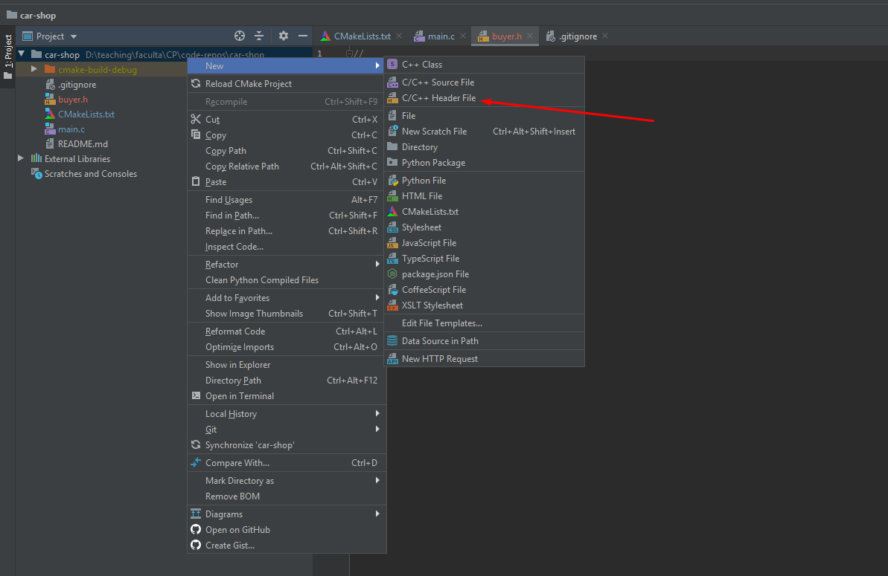

# Refacoring into multiple files

## Overview

## Refactoring into buyer files

Create a new file called `buyer.h`:



Upon creation, it should automatically have this content:


We will want to move out of main.c the functions related to the buyer:


The `buyer.h` will have then the following content:
```c
//
// Created by roxanappop on 10/31/2019.
//

#ifndef CAR_SHOP_BUYER_H
#define CAR_SHOP_BUYER_H

//function prototypes

void inputPersonalData(char firstName[], char lastName[], char phoneNumber[], char address[]);
void displayPersonalData(char firstName[], char lastName[], char phoneNumber[], char address[]);

#endif //CAR_SHOP_BUYER_H
```

We will create a source file called `buyer.c`:


Into this file we move the buyer-related functions, obtainingin `buyer.c` (so we remove them from `main.c`):
```c
#include <stdio.h>

void inputPersonalData(char firstName[], char lastName[], char phoneNumber[], char address[]) {
    // Input personal data
    printf("Please input your data\n");
    printf("---First name:\n");
    gets(firstName);
    printf("---Last name:\n");
    gets(lastName);
    printf("---Phone number\n");
    gets(phoneNumber);
    printf("---Address\n");
    gets(address);
}

void displayPersonalData(char firstName[], char lastName[], char phoneNumber[], char address[]) {
    printf("Customer data:\n");
    printf("-name: %s %s\n", firstName, lastName);
    printf("-phone number: %s\n", phoneNumber);
    printf("-address: %s\n", address);
}
```

Once we have that, we just have to include `buyer.h` in `main.c` (and we can remove the function delcarations from `main.c`)


