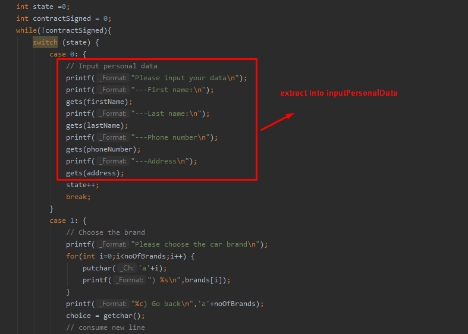
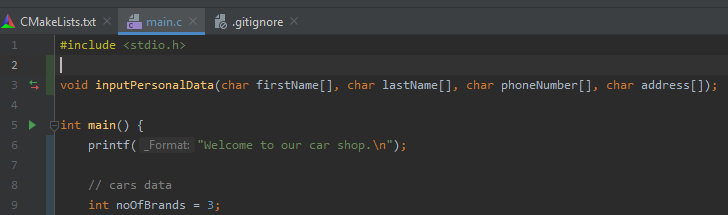

# Extracting functions

## Extracting inputPersonalData



This is the function implementation. The data that we want to read is sent as parameters. 

```c
void inputPersonalData(char firstName[], char lastName[], char phoneNumber[], char address[]) {
    // Input personal data
    printf("Please input your data\n");
    printf("---First name:\n");
    gets(firstName);
    printf("---Last name:\n");
    gets(lastName);
    printf("---Phone number\n");
    gets(phoneNumber);
    printf("---Address\n");
    gets(address);
}
```

We will call this function in our switch statement:


If we define `inputPersonalData` bellow our main, we need to declare it above the main function, so we can use it inside the main function:
This is the declaration:
```c
void inputPersonalData(char firstName[], char lastName[], char phoneNumber[], char address[]);
```

And we will place it here:




## Extracting chooseCarBrand

We can next extract reading the car brand:


```c
char chooseCarBrand(int noOfBrands, char brands[][10]){
    // Choose the brand
    printf("Please choose the car brand\n");
    for(int i=0;i<noOfBrands;i++) {
        putchar('a'+i);
        printf(") %s\n",brands[i]);
    }
    printf("%c) Go back\n",'a'+noOfBrands);
    char choice = getchar();
    // consume new line
    getchar();
    return choice;
}
```


We define it below the other function, thus having:
```c
#include <stdio.h>

void inputPersonalData(char firstName[], char lastName[], char phoneNumber[], char address[]);
char chooseCarBrand(int noOfBrands, char brands[][10]);
```

## Defining some constants

We can see that we had to pass `10` as max size of brand name in this function. And we also did it when defining the brands array of string in the main function. It's hard to keep track like that. And if we wanted to say the brand names should be as much as 20 characters, we would have to change that in a few places. So let's define the max brand name length as a constant:
```c
#define MAX_BRAND_NAME 10
```
Let's use it in the function header:
```c
char chooseCarBrand(int noOfBrands, char brands[][MAX_BRAND_NAME]);
...
char chooseCarBrand(int noOfBrands, char brands[][MAX_BRAND_NAME])
```
And in the declaration of brands in main:
```c

char brands[][MAX_BRAND_NAME] = {"Audi","BMW","Bentley"};
```

## Extracting chooseCarModel

We will extract this code:


Into this function:

```c
char chooseCarModel(int noOfModels, char models[][MAX_MODEL_NAME], double prices[], char brand[]){
    printf("Please choose the car model for brand %s\n",brand);
    for(int i=0;i<noOfModels;i++) {
        putchar('a'+i);
        printf(") %s (%.2f)\n",models[i], prices[i]);
    }
    printf("%c) Go back\n",'a'+noOfModels);
    char choice = getchar();
    // consume new line
    getchar();
    return choice;
}
```

Put the declaration with the other declarations:
```c
void inputPersonalData(char firstName[], char lastName[], char phoneNumber[], char address[]);
char chooseCarBrand(int noOfBrands, char brands[][MAX_BRAND_NAME]);
char chooseCarModel(int noOfModels, char models[][MAX_MODEL_NAME], double prices[], char brand[]);
```
Then we will call it like this


## Extracting functions for handling additional items

We can extract at least two functions from the additional items step:


The two functions are:
```c
void printAdditionalItemsChoices(int noAdditionalItems, char additionalItems[][MAX_ADDITIONAL_ITEM_NAME], double additionalItemsPrices[]) {
    // Choose the additional items
    printf("Choose additional items (separated by comma)\n");
    for (int i = 0; i < noAdditionalItems; i++) {
        putchar('a' + i);
        printf(") %s (%.2f)\n", additionalItems[i], additionalItemsPrices[i]);
    }
    printf("%c) Go back\n", 'a' + noAdditionalItems);
}

int chooseAdditionalItems(int chosenAdditionalItems[], char firstChoice) {
    int noAddItemsChosen = 0;
    char choice = firstChoice;
    while (choice !='\n') {

        chosenAdditionalItems[noAddItemsChosen] = choice - 'a';
        noAddItemsChosen++;
        //read comma
        char comma = getchar();
        if(comma=='\n'){
            //after the last letter, a new line entered
            break;
        }
        choice = getchar();
    }
    return noAddItemsChosen;
}
```

Which can be called like:


To call them like that in main, they will be declared at the top with the other functions.

## Extracting functions for handling the contract

We can extract at least two functions when displaying the contract:


With their definition:

```c
void displayPersonalData(char firstName[], char lastName[], char phoneNumber[], char address[]) {
    printf("Customer data:\n");
    printf("-name: %s %s\n", firstName, lastName);
    printf("-phone number: %s\n", phoneNumber);
    printf("-address: %s\n", address);
}

void displayCarData(char model[], double modelPrice, int noAddItemsChosen, int chosenAdditionalItems, char additionalItems[][MAX_ADDITIONAL_ITEM_NAME],
                    double additionalItemsPrices) {
    printf("Car data:\n");
    printf("-car model: %s (%.2f)\n", model, modelPrice);
    double additionalItemsPrice = 0;
    for(int i=0;i<noAddItemsChosen;i++) {
        additionalItemsPrice += additionalItemsPrices[chosenAdditionalItems[i]];
    }
    printf("-additional items (%.2f)\n", additionalItemsPrice);
    if(noAddItemsChosen!=0){
        for(int i=0;i<noAddItemsChosen;i++) {
            printf("--%s (%.2f)\n", additionalItems[chosenAdditionalItems[i]], additionalItemsPrices[chosenAdditionalItems[i]]);
        }
    }
    printf("Total price: %.2f\n", modelPrice + additionalItemsPrice);
}
```


