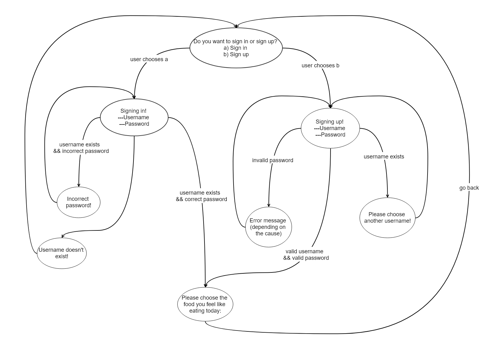

You will add signing up functionality to the `food-ordering` application. First, the user will have to choose between siging in or signing up.

The required functionality can be visualized in the diagram below:



If the user chooses to sign in, he will have to provide an existing username and associated password. If he:
* provides an existing username with the correct password, he will get to the food types choosing
* provides an invalid username (that doesn't exist), regardless the password, he will be promted with the message: "Username doesn't exist", then be redirected again to the step in which he is asked to sign up or sign in
* provides an existing username but with the incorrect password, he will pe promted with the message: "Incorrect password" and be asked again to provide the username and password

For now, we will have a predefined user with username `admin` and password `admin`, so we can sign in without having to create a user first. 

If the user chooses to sign up, he will have to provide a new (non-existing) username and password. If he:
* provides a non-existing username and valid password, he will get to the food types choosing
* provides an existing username, he will be prompted with the message "Please choose another username!" and repeat the step
* provides a non-existing username, but an invalid password, he will be prompted with an explanatory message and repeat the step

If the user goes back from choosing the food type, he goes back to choosing between siging in and siging up.

The rules for the password to be valid are:
* the password must be at least 7 chars long
* the password must not contain the username
* the password must contain one of the following characters: `.`,`_`,`!`
* the password must contain digits

For error messages, please look at the constants you will have to define (messages table bellow):

| Message key                 | Value                                                                     |
| --------------------------- | ------------------------------------------------------------------------- |
| ERROR_PASSWORD_LONG         | "The password must be at least 7 chars long"                              |
| ERROR_PASSWORD_NOT_USERNAME | "The password must not contain the username"                              |
| ERROR_PASSWORD_SPECIAL_CHAR | "The password must contain one of the following characters: `.`,`_`,`!`"  |
| ERROR_PASSWORD_DIGITS       | "The password must contain digits"                                        |
| SIGN_IN_UP                  | "Do you want to sign in or sign up?"                                      |
| SIGN_IN                     | "Sign in"                                                                 |
| SIGN_UP                     | "Sign up"                                                                 |
| SIGNING_IN                  | "Signing in!"                                                             |
| SIGNING_UP                  | "Signing up!"                                                             |
| USER_NOT_FOUND              | "Username doesn't exist"                                                  |
| DUPLICATE_USER              | "Please choose another username!"                                         |
| INCORRECT_PASSWORD          | "Incorrect password"                                                      |

A few examples follow:

```
Welcome to Food Thingies!
Do you want to sign in or sign up?
a) Sign in
b) Sign up
>a
Signing in!
---Username
>admin
---Password
>admin
Please choose the food you feel like eating today:
```

```
Welcome to Food Thingies!
Do you want to sign in or sign up?
a) Sign in
b) Sign up
>a
Signing in!
---Username
>sdss
---Password
>asd
Username doesn't exist
Do you want to sign in or sign up?
a) Sign in
b) Sign up
>b
Signing up!
---Username
>sdss
---Password
>asd
The password must be at least 7 chars long
>asd.1234
Please choose the food you feel like eating today:
```
